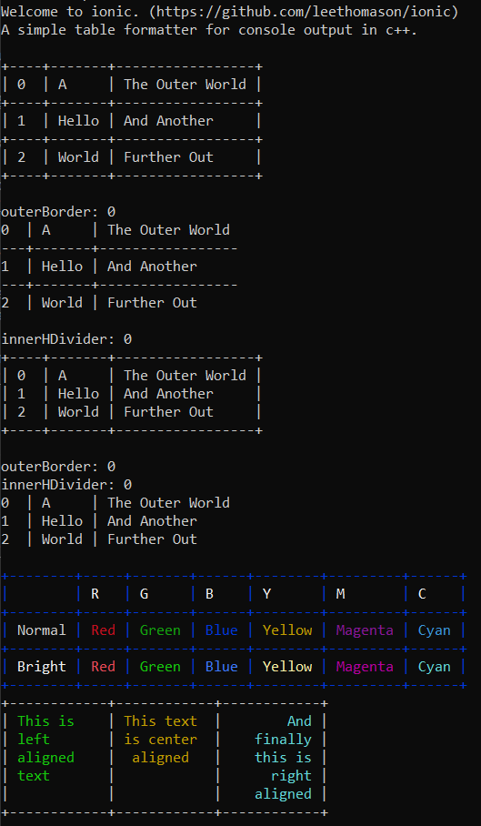

# Ionic

A C++ library for outputting tables to the console.

[](https://github.com/leethomason/ionic/actions/workflows/test.yml)



Tested on Windows, Linux, and OSX.

Ionic is a simple library for outputting tables to the console. It can print
in color, line break, align text, and supports several output styles.
Ionic is simple; it doesn't have a lot of features, but it's easy to use, and
runs reasonably efficiently.

Ionic is similar to Tabulate (<https://github.com/p-ranav/tabulate>) but it is
much simpler, both in code and features. Ionic has built in support for
terminal width, which is a convenience Tabulate does not have.

It has no dependencies beyond C++ 17. Ionic does have platform code - it calls
windows / linux / osx functions to initialize the console and query size.

## Install and Build

Ionic is one header and one cpp file. The best way to use it is cmake's
fetch_content. Here's an example:

```cmake
include(FetchContent)
...
FetchContent_Declare(
  ionic
  GIT_REPOSITORY https://github.com/leethomason/ionic.git
  GIT_TAG        <current git commit hash>
)
FetchContent_MakeAvailable(ionic)
```

Regrettably there is a bug in the ionic makefile, so you will also need to add
the source files to your project. Here's an example:

```cmake
add_executable(MyExample simple_example.cpp ${ionic_SOURCE_DIR}/ionic.cpp)
```

Which is very annoying, and I'd appreciate a PR to fix it. (I'll fix it as soon
as I understand cmake well enough.)

You can also just copy the two files (ionic.h and ionic.cpp) into your project.

### Versioning

There is no versioning and won't be. On other projects I've found versioning
and the infrastructure around it was more effort than the code itself. This is
a very simple code base, will stay simple, and you can get the
version you want from the git tag.

Main is kept stable with automated tests.

## Usage

### Creating Tables

1. Construct a Table with TableOptions. (See TableOptions for features that can be set.)

```c++
        ionic::TableOptions options;
        options.outerBorder = true;
        options.innerHDivider = false;

        ionic::Table table(options);
```

2. Optional: Set the column format with setColumnFormat(). You can specify columns to be
   fixed width or flex width. If you don't setColumFormat(), all columns will be flex.

   When you specify a column width, it is the width of the text, not the width of
   the column with padding and whitespace and such.

```c++
        table.setColumnFormat({
            {ionic::ColType::fixed, 4},
            {ionic::ColType::flex} });
```

3. Add text rows with `addRow()`. The number of columns in `addRow()` calls and
   `setColumnFormat()` calls must match.

```c++
        table.addRow({ "A", "B" });
        table.addRow({ "C", "D" });
```

4. Optional: Set the color and alignment of individual cells, rows, columns, or the entire table. Use `setCell()`, `setRow()`, `setColumn()`, and `setTable()`.

   `std::optional` is used here, so you can specify color and/or alignment.

```c++
        table.setCell(1, 1, { ionic::Color::red }, {});
```

5. Call `format()` to get the formatted table as a string, or `print()` to print it to the console or use the `<<` operator to print it to an ostream.

```c++
        table.print();
```

### Complete Example

More examples in the "tests.cpp" file.

```c++
    #include "ionic/ionic.h"

    ...

    ionic::TableOptions options;
    options.outerBorder = false;
    ionic::Table table(options);

    table.setColumnFormat({ 
        {ionic::ColType::fixed, 2}, 
        {ionic::ColType::flex}, 
        {ionic::ColType::flex} });
    table.addRow({ "0", "A", "The Outer World" });
    table.addRow({ "1", "Hello", "And Another" });
    table.addRow({ "2", "World", "Further Out" });

    table.print();
```

### Notes on Color

Colors aren't stable between OSs, so ionic does a "best effort" to set colors.

Ionic uses the approach of inserting color commands into the generated string.
This has some advantages and some disadvantages. If color isn't in your environment,
your can set the `static`:

```c++
        ionic::Table::colorEnabled = false;
```

To disable color output.

### Whitespace

Hopefully white space is handled "as you would expect." Nevertheless, let's
take a look.

Consider the canonical string `Hello, World\n` to
illustrate how ionic handles whitespace.

Note: The trailing newline (and other whitespace) will be discarded.

Output without breaks:

```text
Hello, World
````

Output if breaks used:

```text
Hello,
World
````

Now consider: `Hello,\nWorld\n`

The output will always be:

```text
Hello,
World
````

#### Markdown

Markdown is wonderful, and a common input, but it's a little tricky. Consider:

```text
A group searches in the Antarctic. 
It is a long and perilous
journey.

They are unprepared for the
strange secrets that they uncover.
```

There are trailing spaces! Single new lines.
Double new lines! Exciting!

Ionic provides a "preprocess" function to help with this. You can call `ionic::Table::normalizeMD()` to
covert MD input to something ionic can handle.

There is a `nNewLine` parameter.

If `nNewLine` is 1:

```text
A group searches in the Antarctic. It is a long and perilous journey.
They are unprepared for the strange secrets that they uncover.
```

If `nNewLine` is 2:

```text
A group searches in the Antarctic. It is a long and perilous journey.

They are unprepared for the strange secrets that they uncover.
```

After which the usual whitespace rules (above) apply.

## Thanks

Enjoy! I hope you find it useful.
